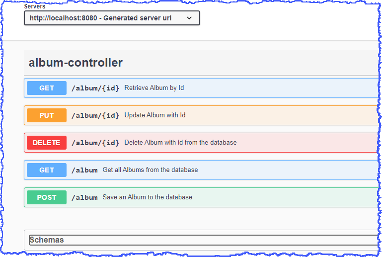

# Spring Boot - Ecommerce Application

### Areas covered

For further reference, please consider the following sections:
#### Web
* _Spring Boot Starter Web_
* Lombok
* Web Layer - REST endpoints, HTTP methods added to Package com.example.springbootecom.controller
* Web Layer Testing - @WebMVCTest(AlbumController.class) / MockMVC
* _Spring Boot Starter Validation_
* Validation of **AlbumRequestDTO** at REST endpoints
* Custom Validation aswell as Spring out-of-the-box validations

#### Exception Handling
* Add an Exception Handler _@RestControllerAdvice_ Package com.example.springbootecom.exception
* Bespoke ServiceResponse (instead of ResponseEntity) to improve Response to User

#### Data Layer


* Spring Boot Starter JPA (using H2 database initially)
* application.properties - enable H2 console

```yaml
spring:
  h2:
    console:
     enabled: true
    driver:
      username: sa
      password:
  datasource:
     url: jdbc:h2:mem:testdb
```


* Add DTO, DAO - Album CRUD Repository, Entity to isolate txfer data between layers

#### Testing
* Web Layer Testing - testing endpoints - CRUD operations
* Using @WebMvcTest and MockMVC
* Test raising and handling exceptions _@RestControllerAdvice_

#### Logging
* _Spring Boot Starter Logging_ included as part of _Spring Boot Starter Web_ which implements Logback (default) - logback-core & logback-classic (SL4J API)
* application.properties - set logging level to DEBUG during dev
```yaml
logging:
  level:
    com.example.springbootecom: DEBUG
  file:
    name: app.log
```

* Define logger.info, logger.debug, logger.error
* Add logging into Service and Controller
* Handler - Write to logfile

#### Documentation using Swagger/OpenAPI 3

```xml
<dependency>
    <groupId>org.springdoc</groupId>
    <artifactId>springdoc-openapi-ui</artifactId>
    <version>1.6.4</version>
</dependency>
```
then use this link

```plaintext
http://localhost:8080/swagger-ui/index.html
```
or
```plaintext
http://localhost:8080/v3/api-docs
```

for JSON



#### Actuator


* Standard endpoints
* Custom actuator endpoint
* 

#### Maven Multi-Module

Setup the project as Maven Multi-Module (Inheritance)

* Create a parent module
* Set the PARENT of the parent module to be Spring Boot

```xml
<groupId>org.example</groupId>
<artifactId>SpringBootEcomAppnMultiModule</artifactId>
<version>1.0-SNAPSHOT</version>
<packaging>pom</packaging>
<parent>
  <groupId>org.springframework.boot</groupId>
  <artifactId>spring-boot-starter-parent</artifactId>
  <version>3.1.0</version>
  <relativePath/> <!-- lookup parent from repository -->
</parent>
```
* note that the packaging is POM
* define the modules (more will follow)

```xml
<modules>
  <module>SpringBootEcom</module>
  <module>album-order-service</module>
</modules>
```

* since child modules Inherit from Parent module, can establish common dependencies in the parent
such as Lombok, Actuator for instance

* Add the build-plugins into the parent

```xml
<build>
  <plugins>
    <plugin>
      <groupId>org.springframework.boot</groupId>
      <artifactId>spring-boot-maven-plugin</artifactId>
      <configuration>
        <excludes>
          <exclude>
            <groupId>org.projectlombok</groupId>
            <artifactId>lombok</artifactId>
          </exclude>
        </excludes>
      </configuration>
    </plugin>
  </plugins>
</build>
```
For the child modules, their parent should be the SpringBootEcomAppnMultiModule so each module will have the parent in their POM setup as

```xml
<parent>
    <groupId>org.example</groupId>
    <artifactId>SpringBootEcomAppnMultiModule</artifactId>
    <version>1.0-SNAPSHOT</version>
</parent>
```

#### Spring Boot Email Integration

